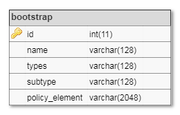
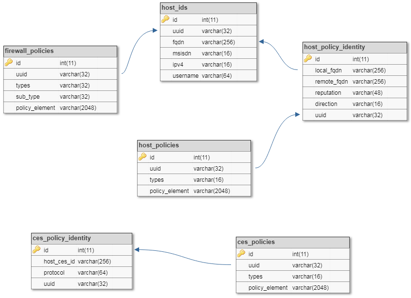

The repository has two databases containing different tables. The two databases are ces_bootstrap and host_policies. 

The folder has 4 files whose details are mentioned below: 

* all_databases_populated.sql : It includes the schema of both databases along with some initially populated data for testing purposes  

* all_databases_raw.sql : It includes the schema of both databases without any pre-populated data. All tables in databases are empty  

* ces_bootstrap_raw.sql : It includes the schema of ces_bootstrap database tables but contains no data  

* host_policies_raw.sql : It includes the schema of host_policies database tables but contains no data   

#### Bootstrap Database Schema

  

#### Session Policies Database Schema

